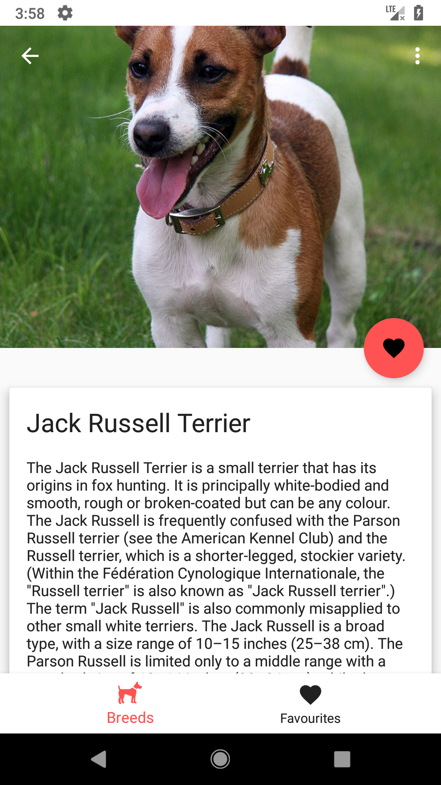

# FW Code Test

In this test we would like to ask you to implement business logic and UI that will result in an amazing app that lets users find
out information about different dog breeds and even to create their own list of favourite breeds.

The outline of the app is simple:
- users see a list of dog breeds
- they can tap on a breed from the list and see a different screen that provides additional info about the breed
- users can also mark a breed as favourite, either from the list or the details screen
- users can access their favourite breeds list

Each tasks provides the additional details required for you to successfully complete the assignments.

The included API provides a call that will return a list of dog breeds.

A dog breed, `BreedDto` will contain the following information:
- a unique ID
- the breed name
- a description for the breed
- a URL for a photo of a dog belonging to the breed
- the breed origin

For task #4, the API includes a method `performImportantOperation()` that will always return an error.

### Important

- Depending on your level of experience we can accept incomplete submissions
- When evaluating your submission we will pay attention not only to the code-related choices but also to the overall look and feel of the app!
- You are welcomed to add animations, transitions, tests and everything else you want - these will be taken into consideration but are NOT mandatory
- **You can use Kotlin or Java**

## Tasks

### 1.  Show list of all breeds
Update `BreedsListFragment` to displays a list of all available breeds.
 
 - implement logic to get the list of breeds from the `data` layer
 - create UI to display the list of `Breeds`
 - when tapping on a Breed item you should open the `BreedDetailsFragment`
 

You are free to choose to use any design pattern you see fit.

You should aim to implement this feature as you would do in a real world app, paying attention to UI.

Extra points for adding cool transitions and unit tests.

The screen can look like the following screenshot, you are also free to implement your own design if you wish:


### 2.  Breed detail screen
Update `BreedDetailsFragment` to displays details of the selected breed.
 
  - implement logic to get the details for the breed
 - create UI to display the `Breed` information
 

You are free to choose to use any design pattern you see fit.

You should aim to implement this feature as you would do in a real world app, paying attention to UI.

Extra points for adding cool transitions and unit tests.

The screen can look like the following screenshot, you are also free to implement your own design if you wish:



### 3.  Favourite breeds
Update `FavoriteBreedsFragment` to display a list of favourite breeds(similar UI with the `BreedListFragment`).

You will also need to implement the logic of marking a `Breed` as favourite.
 
 - update `BreedDetailsFragment` to mark/unmark a Breed as favourite
 - create a database to save & read information about favourite `Breeds`
 - create required components to interact with the database
 - show list/grid of favourite Breeds in `FavoriteBreedsFragment`
 - favourite Breeds should be loaded ONLY from the database
 - when tapping on a Breed marked as favourite you should open the `BreedDetailsFragment`
 

You are free to choose the technology for the database (`Room`/`Realm`)

You should aim to implement this feature as you would do in a real world app, paying attention to UI.

Extra points for adding cool transitions and unit tests.

### 4. Error propagation
The API contains a `performImportantOperation` method that WILL ALWAYS throw an error!

- update `MainActivity` to call that method when the overlay menu item is tapped
- implement the mechanism necessary to propagate the server error to the
 UI layer (show the user the actual error message from the server).

It is up to you to decide how the message will be shown on the UI(AlertDialog, Snackbar, Toast, etc.)

More API details can be found in the [API Reference] section.

### 5. Short `README.md`

We want you to write a *README.md* file in which you briefly provide details about the choices you
made (design patterns, extra libraries, etc.) and the reasons for those choices.

**Note:** this task is MANDATORY for all experience levels! - including incomplete submissions

## Notes
- `MainRepository#performImportantOperation()` will be the network call that will trigger the error
- the layouts for the list and details screen are provided in the `res` folder
- you can update any part of the existing code in order to apply the desired patterns or use your preferred frameworks/libraries
- the project uses the latest version of `gradle` but you can modify it to use a lower version if you need to


## API Reference

We are going to use a `MockServer` in order to simplify making network calls for the purpose of this test.


 **NOTE: `MockServer` does NOT need to be modified!**

### Get Breeds

``` @GET("breeds") Single<BreedsListDto> getBreeds();```

This call will return a list of dog breeds. The JSON we use for mocking this call returns a named array of breeds so we used a wrapper object `BreedListDto`.

The `RestManager`(class which handles making the network calls) will return a `List<BreedDto>` instead of the wrapped object:


	public Single<List<BreedDto>> getBreeds() {
        return restService.getBreeds()
                .map(BreedsListDto::getBreeds)
                .compose(new SingleWorkerTransformer<>(schedulersProvider));
    }
   

The JSON used  for this call can be found in *FW-CodeTest-Android/fwCodeTestAndroid-java/src/main/assets/breeds.json*


### Important Operation

``` @POST("important_operation") Completable performImportantOperation();```

Whenever you make this call you will receive a `400` error with the following body: 

``` {"error": "The world is ending, cannot process request"}```


